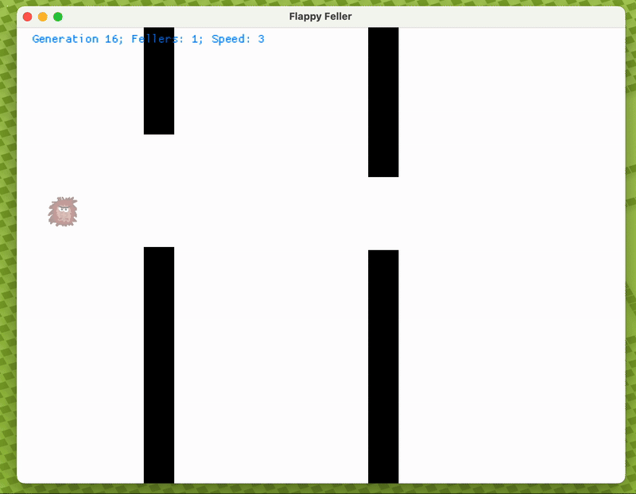

# Flappy Fellers

A game of flappy fellers, they just flap around, trying to avoid flying too high or too low or crashing into pipes. What a life!

Played by a neuroevolution AI that is evaluated by its performance, selected, mutated and bred. Each generation does better than the last!

Uses my [Neural Network Study](https://github.com/brend/neural-network-study) framework. Inspired by [The Coding Train](https://thecodingtrain.com/challenges/100-neuroevolution-flappy-bird).

<figure>
  
  <figcaption>One flappy feller has developed the ability to navigate the maze.</figcaption>
</figure>
